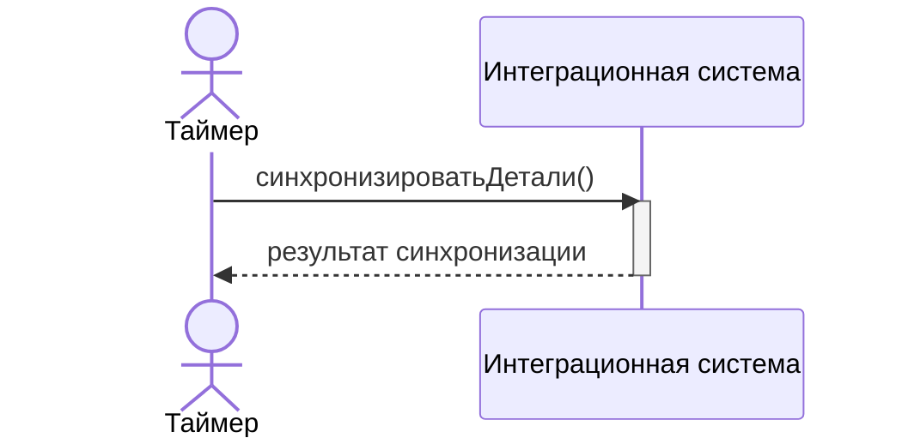
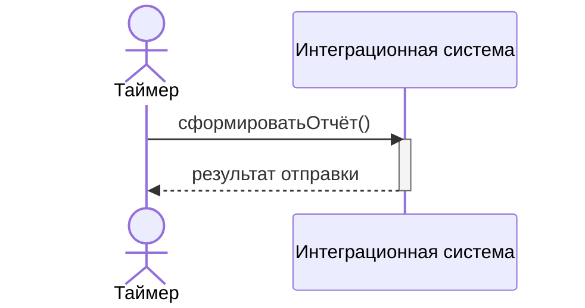

# Документация по архитектуре
<!-- TOC -->
* [Документация по архитектуре](#документация-по-архитектуре)
  * [1. Enterprise Integration Patterns](#1-enterprise-integration-patterns)
    * [1.1 Messaging Channels: Point-to-Point Channel](#11-messaging-channels-point-to-point-channel)
    * [1.2 Message Construction — Document Message](#12-message-construction--document-message)
    * [1.3. Message Routing — Content-Based Router](#13-message-routing--content-based-router)
    * [1.4 Message Transformation — Message Translator](#14-message-transformation--message-translator)
      * [Этап А: SpareDto (CMS JSON) → Part (доменная модель MongoDB)](#этап-а-sparedto-cms-json--part-доменная-модель-mongodb)
      * [Этап Б: Part (MongoDB) → CSV-строка (Report API)](#этап-б-part-mongodb--csv-строка-report-api)
    * [1.5 Messaging Endpoints — Polling Consumer](#15-messaging-endpoints--polling-consumer)
    * [1.6 Systems Management — Control Bus](#16-systems-management--control-bus)
  * [2. Концептуальная модель предметной области](#2-концептуальная-модель-предметной-области)
    * [2.1. Идентификация концептуальных классов](#21-идентификация-концептуальных-классов)
    * [2.2. Идентификация ассоциаций](#22-идентификация-ассоциаций)
    * [2.3. Диаграмма концептуальных классов](#23-диаграмма-концептуальных-классов)
  * [3. Диаграмма последовательности](#3-диаграмма-последовательности)
    * [Синхронизация деталей](#синхронизация-деталей)
    * [Формирование отчёта](#формирование-отчёта)
<!-- TOC -->
## 1. Enterprise Integration Patterns

### 1.1 Messaging Channels: Point-to-Point Channel
Каждый поток данных реализован как изолированный point-to-point канал с одним получателем.

| Канал                   | Источник | Получатель |
|-------------------------|----------|------------|
| `direct:syncToMongo`    | CMS API  | MongoDB    |
| `direct:generateReport` | MongoDB  | Report API |

Сообщение из канала обрабатывается ровно одним компонентом — дублирование исключено.

---

### 1.2 Message Construction — Document Message

CMS API возвращает данные в формате «вот текущее состояние».

```json
{
  "spareCode": "SP12345",
  "spareName": "Brake Pad",
  "price": "15.99",
  "quantity": 100,
  "updatedAt": "2025-09-09"
}
```

### 1.3. Message Routing — Content-Based Router
Ядро логики синхронизации. Каждая запись из CMS маршрутизируется на основе сравнения с данными в MongoDB:
```text
Запись из CMS
├─ spareCode не найден в MongoDB           новая деталь
├─ spareCode найден, updatedAt изменился   обновление
├─ spareCode найден, updatedAt тот же      пропуск
└─ spareCode есть в MongoDB, но нет в CMS  пометка на удаление
```
Решение о маршруте принимается исключительно на основе содержимого сообщения (spareCode и updatedAt).

### 1.4 Message Transformation — Message Translator
Ядро логики синхронизации. Каждая запись из CMS маршрутизируется на основе сравнения с данными в MongoDB:
#### Этап А: SpareDto (CMS JSON) → Part (доменная модель MongoDB)

| Поле      | SpareDto (CMS)        | Part (MongoDB)                    |
|-----------|-----------------------|-----------------------------------|
| price     | "15.99" (String)      | BigDecimal(15.99)                 |
| updatedAt | "2025-09-09" (String) | LocalDate(2025-09-09)             |
| isDeleted | отсутствует           | false (добавляется)               |
| syncedAt  | отсутствует           | LocalDateTime.now() (добавляется) |

#### Этап Б: Part (MongoDB) → CSV-строка (Report API)

Реализовано в CsvPrepareProcessor: доменные объекты преобразуются в массивы строк с разделителем «;» в кодировке UTF-8.

### 1.5 Messaging Endpoints — Polling Consumer
```text
timer:syncCms?period=...  →  опрос CMS API
timer:syncReport?period=... →  генерация отчёта
```
### 1.6 Systems Management — Control Bus

Встроенный механизм Camel для управления роутами в рантайм

| Команда                                         | Действие                                   |
|-------------------------------------------------|--------------------------------------------|
| `controlbus:route?routeId=syncCms&action=stop`  | Остановить синхронизацию                   |
| `controlbus:route?routeId=syncCms&action=start` | Возобновить синхронизацию                  |
| `controlbus:route?routeId=syncCms&action=stats` | Получить статистику обработанных сообщений |


## 2. Концептуальная модель предметной области

### 2.1. Идентификация концептуальных классов

Предметная область — складской учёт запасных частей. Концептуальные классы
выделены на основе существительных из описания задачи:

| Класс      | Категория         | Обоснование                                                       |
|------------|-------------------|-------------------------------------------------------------------|
| **Деталь** | Физический объект | Запасная часть, находящаяся на складе. Объект учёта               |
| **Отчёт**  | Документ          | Файл, описывающий текущее состояние склада для системы отчётности |

### 2.2. Идентификация ассоциаций

| Ассоциация     | Тип                              | Кратность |
|----------------|----------------------------------|-----------|
| Отчет — Деталь | А содержит В (элемент документа) | 1 : N     |

### 2.3. Диаграмма концептуальных классов

Атрибуты выделены как простые типы данных предметной области без привязки к реализации.


## 3. Диаграмма последовательности
### Синхронизация деталей

**Описание системной операции**

| Элемент     | Описание                                                                                                                                                                                                                    |
|-------------|-----------------------------------------------------------------------------------------------------------------------------------------------------------------------------------------------------------------------------|
| Операция    | `синхронизироватьДетали() `                                                                                                                                                                                                 |
| Предусловия | CMS доступна.<br/> Хранилище исторических данных инициализировано                                                                                                                                                           |
| Постусловия | Для каждой детали: создан экземпляр Детали в хранилище (если новая) или обновлены атрибуты (если изменилась датаОбновления). <br/>Для каждой Детали в хранилище, отсутствующей в CMS: атрибут «в обороте» установлен «ложь» |

### Формирование отчёта

**Описание системной операции**

| Элемент     | Описание                                                                                                                                     |
|-------------|----------------------------------------------------------------------------------------------------------------------------------------------|
| Операция    | `сформироватьОтчёт()`                                                                                                                        |
| Предусловия | Система БД содержит хотя бы одну Деталь. Система отчётности доступна                                                                         |
| Постусловия | Создан экземпляр Отчёта с датой формирования.<br/> Отчёт включает все Детали (включая не в обороте).<br/> Отчёт передан в систему отчётности |
